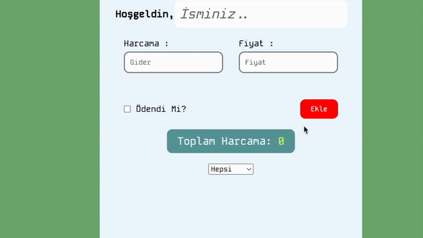

# Spending Calculator Project

This project is a simple spending calculator web application built using HTML, CSS, and JavaScript. It helps users keep track of their expenses by allowing them to input their spending and categorize it. The application provides a summary of total spending and allows users to visualize their spending habits.
## Screenshots

